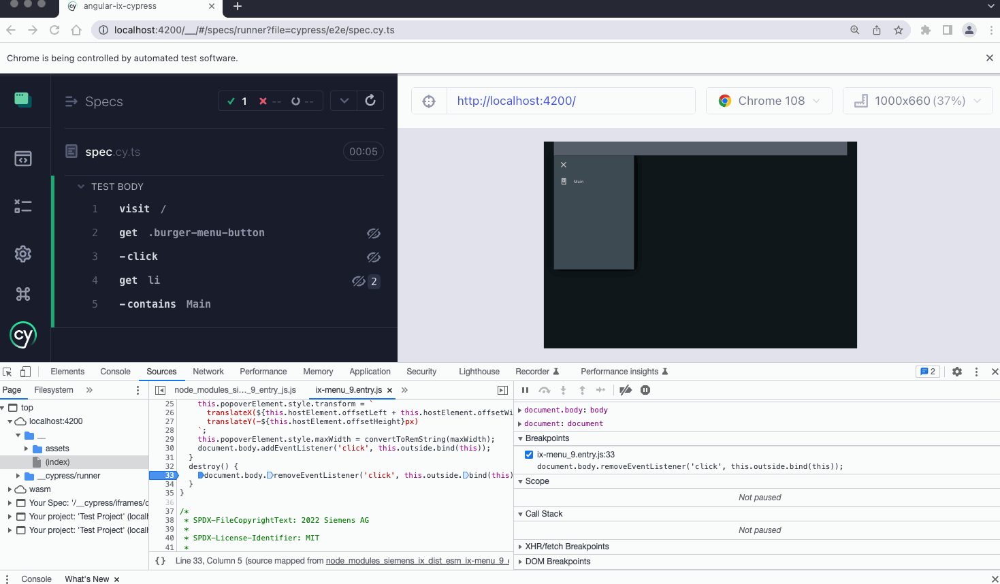

# Angular Ix Cypress

This project was generated with [Angular CLI](https://github.com/angular/angular-cli) version 15.0.3.

## Cypress e2e `document.body` is `null` in `Popover.destroy` bug reproduction

- `npm i`
- `ng serve` in one console
- open Cypress: `npx cypress open --e2e --browser chrome`
- open the spec in the opened Chrome Browser (the tests should pass)
- open the Developer Tools/Console in that browser
- hover over the test steps (DOM snapshots will be loaded)
- `document.body` is `null` &rarr; exception at: [popover.util.ts:L37](https://github.com/siemens/ix/blob/ce5d7cb3e31327e84e02d4a017493ece90caf98e/packages/core/src/components/utils/popover.util.ts#L37)

Screen recording (made with [LICEcap](https://www.cockos.com/licecap/)):

